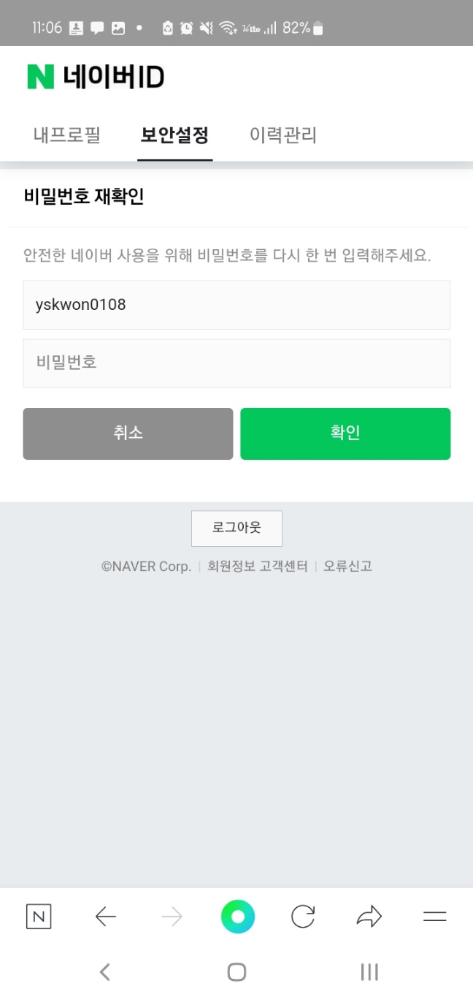
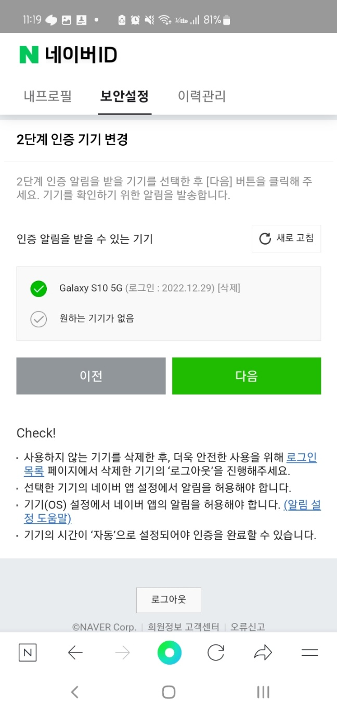

## Index
- [Apple](#Apple)
- [Google](#Google)
- [Naver](#Naver)
- [멤버스앱](#멤버스앱)

## Apple
- 참조 링크 : [https://support.apple.com/ko-kr/HT202667](https://support.apple.com/ko-kr/HT202667)

### 아이디 변경 프로세스
1. appleid.apple.com 으로 이동하여 로그인합니다. → **로그인 되어있는 상태라면 아이디 변경 화면에 접근 가능하게**
2. 로그인 및 보안 섹션에서 'Apple ID'를 선택합니다. → **마이 바디코디 > 내 정보 관리 > 계정 섹션에 전화번호 변경 메뉴 추가 혹은 휴대폰 번호 옆에 화살표 추가?**

3. Apple ID로 사용하려는 이메일 주소를 입력합니다.

4. 'Apple ID 변경'을 선택합니다.
5. Apple ID를 타사 이메일 주소로 변경한 경우, 해당 이메일로 **확인 코드**가 전송되었는지 확인한 후 코드를 입력합니다. → **애플은 이메일 검증을 하고 있고 이메일을 아이디로 사용하기 때문에, 이메일로 확인 코드를 전송해 유저 인증을 하고 있다. 멤버스앱의 경우 아이디가 전화번호이니 SMS 인증 & 비밀번호 확인으로 대체**
6. iCloud 또는 메세지 앱과 같은 서비스를 사용하여 친구 및 동료와 콘텐츠를 공유하고 있는 경우 업데이트한 Apple ID로 해당 서비스에 로그인합니다. → **멤버스앱의 경우 친구 및 동료와 콘텐츠를 공유하는 형태는 아니지만, 기기관리를 통해 여려 기기에 로그인한 비슷한 케이스가 있다. 전화번호를 변경한 경우, 타 기기에서 모두 로그아웃(인증해제) 시키고 업데이트한 전화번호로 다시 로그인하게 하는게 어떨지?**

### 아이디 변경 제약
- Apple ID를 최근에 30일 이내에 생성한 이메일 주소로 변경할 수 없다.
- 타 유저가 사용중인 이메일로 변경할 수 없다.

### Google
- 참조 링크 : [https://support.google.com/accounts/answer/19870?hl=ko&co=GENIE.Platform%3DDesktop](https://support.google.com/accounts/answer/19870?hl=ko&co=GENIE.Platform%3DDesktop)

1. 구글에 접속한 다음, 본인의 아이디로 로그인한다.
2. 프로필 클릭 > Google 계정 관리 > 개인정보 

3. 본인 인증을 위해 비밀번호 한번 더 입력
!
4. 비밀번호 인증 후 변경할 이메일을 입력해서, 인증 메일을 전송한다.

5. 메일 인증 절차가 끝나면 이메일이 변경된다.

## Naver

### 전화번호 변경

1. 프로필 사진 클릭 > 내프로필 메뉴에서 전화번호 옆 수정 버튼을 누른다.

2. 전화번호 인증 및 변경 팝업

3. 휴대폰 번호 변경 후, 기기에 변경 완료 푸시 알림이 옴.

### 2단계 인증
- 전화번호는 변경했으나 기기는 변경하지 않은 경우 → 이미 로그인된 상태이니 내 정보 관리 메뉴로 가서 번호 변경한다.
- 전화번호와 기기를 모두 변경한 경우, 새 기기에서 로그인 시도시 예전 전화번호 SMS로 신규 기기를 인증할 수 없으니 2단계 인증으로 기기인증을 패스하면 어떨까? 예전 기기는 가지고 계신 경우가 많다.

0. 비밀번호 확인
- 문구 참고

2. 2단계 인증을 요청한다

3. 2단계 인증을 설정한 기기에 인증 요청 푸시 알림이 온다.

3. 푸쉬 알림을 클릭해 앱을 켜고, 인증을 완료한다.

## 멤버스앱

#### 전화번호 변경

1. 내 정보 관리 화면
- 마이 바디코디 > 내 정보 관리 > 계정 섹션에 전화번호 변경 메뉴 추가 혹은, 휴대폰 번호 오른쪽에 화살표 추가

2. 비밀번호 확인
- 문구 추가 → 안전한 바디코디 사용을 위해 비밀번호를 다시 한번 입력해주세요.

3. 변경할 휴대폰 번호 인증
- 팝업 헤더 : 휴대폰 기기 인증해주세요 → 권영은님의 회원정보 중 전화번호를 수정하기 위해 인증절차가 필요합니다.
- 버튼 레이블 : 기기 인증 → 변경
- 인증 문자 텍스트 : [바디코디] 휴대전화 번호 변경을 위해 인증번호 [xxxxxx]를 3분 내에 입력해주세요. 직접 변경하지 않으셨다면 보안 설정을 확인하시고, 관리자에게 문의해 주세요. (보안 설정 : 마이 바디코디 > 내 기기 관리)

### 2단계 인증

1. 새 기기에서 로그인시, 휴대폰 기기 인증 화면에 2단계 인증 옵션을 추가한다.
- 비밀번호가 기억나지 않나요? → 전화번호를 변경하셨나요? 

2. 비밀번호 확인

3. 2단계 인증 요청 보내기
- 팝업 헤더 : 비밀번호를 잊으셨나요? → 2단계 인증
- 버튼 레이블 : 인증 해제 → 알림 전송

4. 2단계 인증 요청 푸쉬 알림이 이전 기기에 전송된다.

5. 이전 기기에서 인증 요청을 수락하면, 신규 기기가 인증된다.

5. 기존 기기에 휴대폰 번호 변경 알림 푸쉬 알림이 전송된다.
